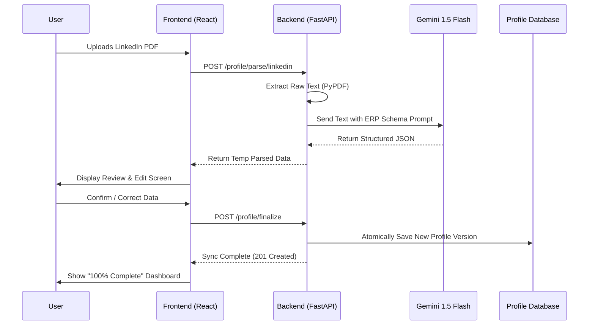
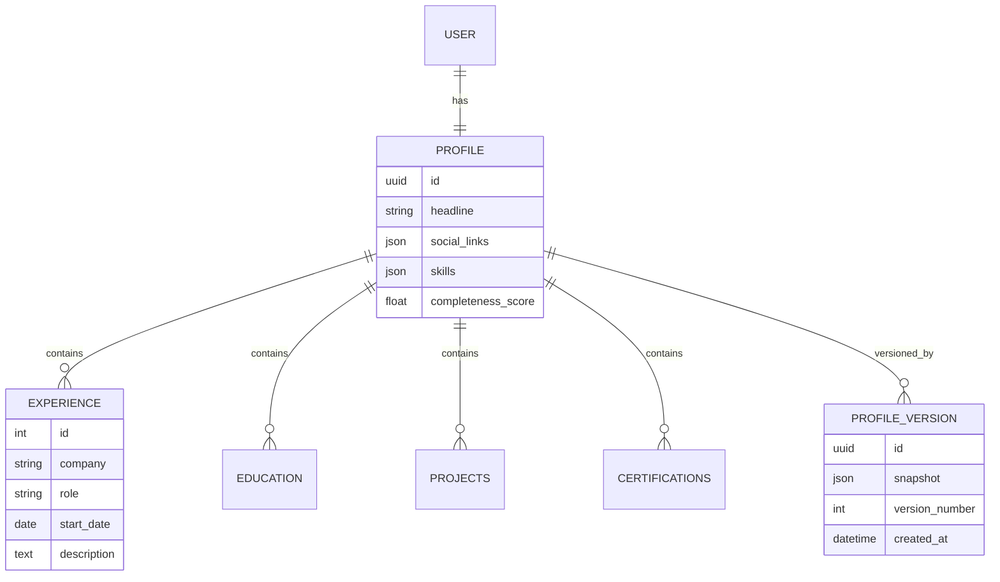

# CHAPTER 3: PRELIMINARY DESIGN AND METHODOLOGY (ENHANCED)

## 3.1 Concept Generation & Need Analysis
The core conceptualization of **SmartApply.ai** is rooted in the "Recruitment Asymmetry" problem. While employers use sophisticated Applicant Tracking Systems (ATS) to deconstruct resumes into data points, candidates are still forced to present their professional value through rigid, flat PDF documents.

### 3.1.1 The Shift: Document-Centric to Data-Centric
SmartApply.ai replaces the traditional "Resume-First" workflow with a "Data-First" architecture. 
- **Legacy Workflow:** User -> Creates PDF -> Uploads to Portal -> Portal Parses (often with errors).
- **SmartApply Workflow:** User -> Ingests Data to ERP -> AI Tailors Data for Specific Role -> Controlled Automation Submits.

### 3.1.2 Conceptual Brainstorming (The 16+ Sections of Identity)
To achieve a "10/10" match rate, we identified 16 key modules that define a modern professional:
1.  **Personal Branding:** Headlines, Bio, Social Portfolios.
2.  **Core Experience:** Roles, Achievement Metrics, Company Context.
3.  **Academic Foundation:** Degrees, GPA, Research, Coursework.
4.  **Technical Stack:** Languages, Frameworks, Infrastructure.
5.  **Soft Skills:** Leadership, Adaptability (Semantic labels).
6.  **Project Portfolio:** GitHub links, Tech stacks used, Team roles.
7.  **Certifications:** Validating authorities and expiry logic.
8.  **Volunteer Work:** Social impact profiling.
9.  **Achievements:** Awards, Scholarships, Competitions.
10. **Languages:** Fluency levels (ILR scale).
11. **Interests:** Personalized cultural fit identifiers.
12. **Recommendations:** Third-party validation metadata.
13. **Skill Growth Metrics:** Historical progression of competencies.
14. **Document Versions:** Role-specific resume/CL snapshots.
15. **Target Roles:** User preferences (Remote, Salary, Tech).
16. **Application History:** Logs of where and when data was sent.

---

## 3.2 Design Constraints – A Comprehensive Multi-Dimensional Analysis

Designing an AI-driven automation platform involves navigating a complex web of constraints.

### 3.2.1 Professional and Ethical Issues
- **Authenticity Constraint:** The AI must not "hallucinate" or invent skills. We enforce **Human-in-the-Loop (HITL)** verification to ensure the candidate's professional integrity is maintained.
- **Transparency:** The platform must explain *why* it scored a match at a certain level, providing users with actionable feedback.

### 3.2.2 Regulatory & Legal Constraints (GDPR/CCPA)
- **Data Sovereignty:** Career data is highly sensitive. We implement **Atomic Vaulting**, where users have the "Right to be Forgotten" and can delete their entire ERP profile with one click.
- **Consent:** Automated browser interactions (Playwright) require explicit, per-session user consent to avoid violating Terms of Service of job boards.

### 3.2.3 Economic and Environmental Constraints
- **Resource Efficiency:** Large-scale PDF parsing is compute-intensive. We use **Gemini 1.5 Flash** to maintain high throughput with lower energy/cost footprints compared to Ultra models.
- **Scalability (Manufacturability):** The backend is built using a **Modular Monolith** pattern on FastAPI, allowing horizontal scaling using Docker containers.

### 3.2.4 Health and Safety Issues
- **Psychological Safety:** Job searching is a major stressor. The system design prioritizes "Reduced Cognitive Load" by automating repetitive form-filling, thereby improving the mental well-being of the user.

---

## 3.3 Design Flow & Alternative Architectures

The team evaluated three distinct architectural designs before finalizing the implementation roadmap.

### 3.3.1 Alternative A: Client-Side Browser Extension (Rules-Based)
- **Concept:** A Chrome extension that stores data in local storage and uses Regex to fill forms.
- **Drawback:** Zero intelligence. Cannot handle complex "Role Tailoring."

### 3.3.2 Alternative B: Microservices-First AI Agent
- **Concept:** Every module (Parsing, Matching, Branding) as a separate micro-service.
- **Drawback:** High "Cold Start" latency and excessive complexity for a initial platform build.

### 3.3.3 Alternative C: The Unified Intelligence Hub (SELECTED)
- **Concept:** A FastAPI/React ecosystem with a centralized Career ERP database and LLM Integration layer.
- **Justification:** Balances development speed with powerful AI capabilities and secure data persistence.

---

## 3.4 Detailed Technical Diagrams

### 3.4.1 System Architecture Block Diagram
```mermaid
graph TB
    subgraph "Frontend (React 19)"
        UI["User Dashboard"]
        SYNC["Identity Sync UI"]
        MATCH["Relevance UI"]
    end

    subgraph "API Gateway (FastAPI)"
        AUTH["JWT / OAuth2"]
        ROUT["API Router"]
    end

    subgraph "Intelligence Layer"
        GEM["Gemini 1.5 Flash"]
        PARS["PDF Extraction (PyPDF)"]
        MATCH_ENG["Semantic Matcher"]
    end

    subgraph "Storage & Action"
        DB[("PostgreSQL\n(Career ERP)")]
        PW["Playwright\n(Automation)"]
    end

    UI <--> ROUT
    SYNC --> ROUT
    ROUT --> AUTH
    ROUT --> PARS
    PARS --> GEM
    GEM --> DB
    MATCH_ENG <--> DB
    PW <-- ROUT
```

### 3.4.2 Sequence Diagram: AI Ingestion & Verification


### 3.4.3 Data Entity Relationship (ER) Diagram


---

## 3.5 Best Design Selection & Reasoned Comparison

| Parameter | Alt A: Local Ext | Alt B: Microservices | Alt C: Unified Hub (Selected) |
| :--- | :--- | :--- | :--- |
| **Intelligence** | Low (Regex) | High (LLM) | **High (LLM)** |
| **Data Sync** | None | High | **High** |
| **Latency** | Instant | High (Inter-service) | **Low (Internal)** |
| **Security** | Minimal | Complex | **Robust (Enterprise)** |
| **Vision Alignment**| Poor | Over-engineered | **Perfect Fit** |

**Conclusion:** Design C was selected because it provides the **"Minimum Path to Intelligence."** It allows us to leverage high-context LLMs while maintaining the data integrity required for a professional ERP system.

---

## 3.6 Implementation Plan & Algorithm

### 3.6.1 The "Sync-Delta" Algorithm
1.  **Extract:** Convert incoming document (PDF/Docx) to normalized UTF-8 text.
2.  **Contextualize:** Gemini 1.5 Flash identifies "Meaningful Sections" (Education, Experience, etc.).
3.  **Schema Mapping:** Convert natural language into a strictly defined TypeScript/Pydantic interface.
4.  **Delta Analysis:** 
    -   If record exists in DB but not in PDF -> *Mark for Archive*.
    -   If record exists in PDF but not in DB -> *Mark for Creation*.
    -   If content differs -> *Mark for Overwrite (User Confirmation Required)*.
5.  **Finalization:** Build the new `ProfileVersion` JSON and commit transactionally to PostgreSQL.

### 3.6.2 Phased Roadmap
- **Phase 1 (Week 1-3):** Foundation - Auth, Database Schema, and Basic Manual Entry.
- **Phase 2 (Week 4-6):** Intelligence Ingestion - LinkedIn/Resume Parsers and Gemini Logic.
- **Phase 3 (Week 7-9):** Action Layer - Resume Generator and Playwright Basic Filling.
- **Phase 4 (Week 10-12):** Optimization - Relevance Scoring Engine and UX Polish.
